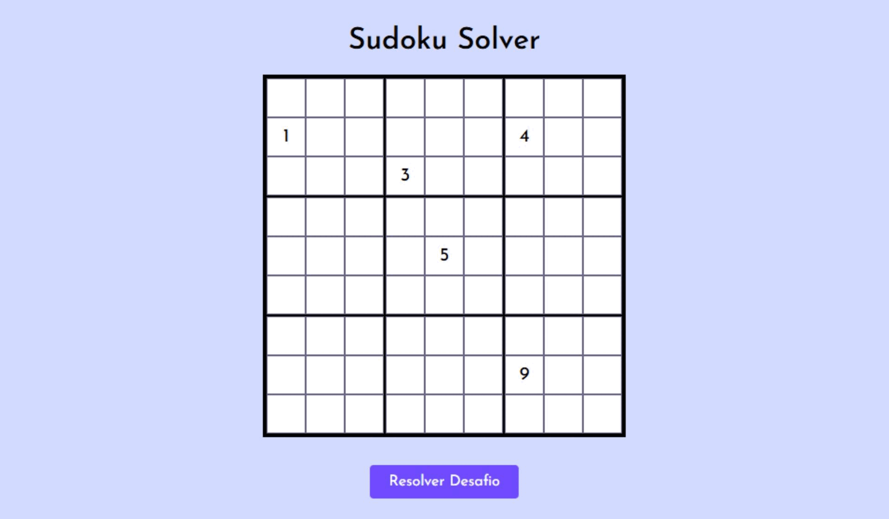

# Sudoku Solver

## Sobre o projeto

Um aplicativo simples, cuja função é resolver automaticamente desafios de Sudoku, baseado nas entrada do usuário.

## Como utilizar

Digite um valor de 1 a 9 em qualquer célula, nas células que desejar, logo após clique no botão "Resolver Desafio".

## Informações

Projeto desenvolvido utilizando apenas HTML, CSS e JavaScript.

